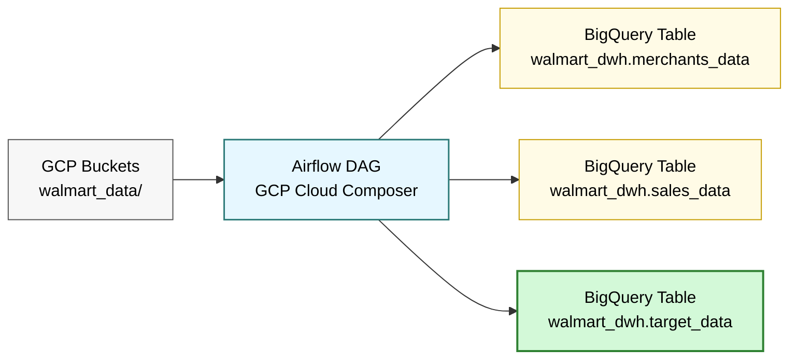

# Walmart Data Ingestion Using Airflow to GCP BigQuery

This project is on how to ingest data using Apache Airflow (Managed Apache Airflow on GCP Composer) to GCP BigQuery. It involves creating buckets to store the data, creating GCP Composer, and creating tables in BigQuery
all automatically using managed Apache Airflow.

## Architecture

This project leverages the following Google Cloud Platform (GCP) services:  

### **GCP Cloud Storage Buckets**  
**Purpose**: Scalable object storage for files (raw/processed data, backups, etc.).  
**Key Features**:  
✔ **Fully managed** with multi-regional/regional storage tiers.  
✔ Fine-grained access control (IAM, ACLs).  
✔ Seamless integration with BigQuery, Composer, and other GCP tools.  
**Example Use Case**:  
- Store ingested raw data (CSV/JSON) before processing.  
- Archive processed outputs.  

### **GCP Cloud Composer (Managed Apache Airflow)**  
**Purpose**: Orchestrate and automate workflows.  
**Key Features**:  
✔ **Serverless Airflow** with auto-scaling.  
✔ Python-based DAGs for workflow definitions.  
✔ Native integration with GCP services (BigQuery, GCS, Pub/Sub).  
**Example Use Case**:  
- Schedule ETL jobs to transform and load data into BigQuery.  
- Monitor pipeline health via Airflow’s UI.  

### **GCP BigQuery**  
**Purpose**: Serverless data warehouse for analytics.  
**Key Features**:  
✔ **Petabyte-scale SQL queries** with fast execution.  
✔ Built-in ML (BigQuery ML) and geospatial analysis.  
✔ Pay-as-you-go pricing (storage + compute).  
**Example Use Case**:  
- Analyze processed data with SQL.  
- Train ML models directly in BigQuery.  

### **🛠️ How They Integrate**  
1. **GCS Buckets** → Store raw data.  
2. **Composer** → Orchestrates data pipelines (e.g., clean/transform data).  
3. **BigQuery** → Analyze results or serve dashboards.  

### **📌 Notes**  
- Ensure IAM permissions are configured for cross-service access.  
- Costs vary by usage (e.g., BigQuery query volume, GCS storage class).  

## Data Flow Description

1. **GCP Buckets**: Raw JSON files are stored under `walmart_data/` directory.
2. **Airflow (Cloud Composer)**: A daily DAG performs:
   - Dataset and table creation in BigQuery (if not exists)
   - Data ingestion from GCS to BigQuery using `GCSToBigQueryOperator`
   - Merge operation to create enriched final table (`target_data`)
3. **BigQuery**: Stores cleaned, structured, and joined data across three tables:
   - `merchants_data`
   - `sales_data`
   - `target_data`
  
## Directory structure

walmart-data-ingestion-using-airflow-to-bigquery/  
1. README.md  -> Project documentation  
2. airflow_gcp_bigquery_dag.py  -> Airflow DAG for ETL workflow
3. data/ -> Sample input data (JSON)                             
    ├── merchants_1.json              
    ├── merchants_2.json  
    ├── walmart_sales_1.json          
    └── walmart_sales_2.json  

## Steps

### Create buckets in GCP

1. Create a bucket by clicking on `Create` button. Choose region and other settings like replication, etc., as per requirements

2. Created two folders `merchants` and `sales` to store the json data.

 ### Create Airflow Instance in GCP Composer

 1. When creating GCP Composer for the first time, we need to enable GCP COmposer API.
 2. Click on `Create Environment` button. Choose the modern option.
 3. Create a Airflow Environment using the below options. Change it as per usage. I have opted for small for this project.

 4. Click on `Create` button.

 5. It will take some time to create the Airflow instance.
 6. Upload the day python file by clickin on the `DAGs` link and then `OPEN DAGS FOLDER` option.

## Results

### Airflow Results

All the tasks in the dag run perfectly

Let's check the tables - 

**Merchant Table**

**Sales Table**

**Merged Target Table**

